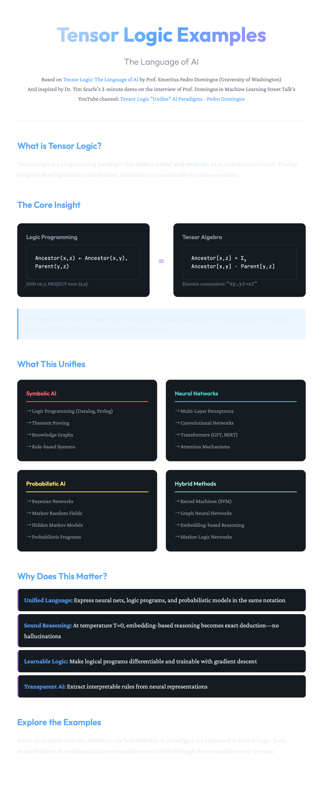

<div align="center">

# Tensor Logic Examples

**Extended with Neural Nestor Gauge Logic Framework**

</div>

A collection of educational examples of **Pedro Domingos' Tensor Logic** — a programming paradigm that unifies neural and symbolic AI at a fundamental level. You can see them [here](https://tensor-logic.samkirk.com).

**NEW**: This repository now includes:

1. **Neural Nestor Gauge Logic** framework - extends Tensor Logic with:
   - **Nestors**: Nested tensors forming rooted hypertrees with fiber bundle hypernodes
   - **Tensor Embeddings**: Shape fiber forest features of typed hyper-graph neural networks  
   - **Smooth Differential Gradients**: Categorical logic of a generalized gauge transformer
   - **Formal Verification**: Mathematical foundations verified with Lean 4
   
   See [Neural Nestor Gauge Logic Documentation](docs/Neural-Nestor-Gauge-Logic.md) for details.

2. **Hypercomplex Extensions** - extends from Boolean/Real to Complex/Quaternion/Octonion and beyond:
   - **Complex (ℂ)**: Quantum-inspired AI with phase and amplitude
   - **Quaternion (ℍ)**: 3D spatial reasoning with rotation-equivariant networks
   - **Octonion (𝕆)**: Non-associative logic for context-sensitive reasoning
   - **Sedenion (𝕊) and higher**: Over-parameterized systems and hyper-dimensional computing
   
   See [Hypercomplex Extensions Documentation](docs/Hypercomplex-Extensions.md) for details.

Based on the paper: [Tensor Logic: The Language of AI](https://arxiv.org/abs/2510.12269) by Prof. Emeritus Pedro Domingos (University of Washington)

And inspired by Dr. Tim Scarfe's 2-minute demo (with co-host Dr. Keith Duggar) on the interview of Prof. Domingos in Machine Learning Street Talk's YouTube channel: [Tensor Logic "Unifies" AI Paradigms - Pedro Domingos](https://youtu.be/4APMGvicmxY?si=T0ic6RgZ-epTPBMt&t=1070)



<!-- TOC -->

- [The Core Insight](#the-core-insight)
- [Hypercomplex Extensions](#hypercomplex-extensions)
- [Demo Features](#demo-features)
  - [8 Interactive Examples](#8-interactive-examples)
  - [Core Tensor Logic Engine](#core-tensor-logic-engine)
- [What This Unifies](#what-this-unifies)
  - [Symbolic AI](#symbolic-ai)
  - [Neural Networks](#neural-networks)
  - [Probabilistic AI](#probabilistic-ai)
  - [Hybrid Methods](#hybrid-methods)
- [Why Does This Matter?](#why-does-this-matter)
- [References](#references)
- [TO DO](#to-do)
- [Assessment](#assessment)
- [Getting Started for Development](#getting-started-for-development)
- [License](#license)

<!-- /TOC -->

## The Core Insight

The key insight of Tensor Logic is that **logical rules and Einstein summation are essentially the same operation**:

| Logic Programming | Tensor Algebra |
|------------------|----------------|
| `Ancestor(x,z) ← Ancestor(x,y), Parent(y,z)` | `Ancestor[x,z] = Σ_y Ancestor[x,y] · Parent[y,z]` |
| JOIN on y | Contract over index y |
| PROJECT onto (x,z) | Keep indices x, z |

The only difference is the atomic data type:
- **Boolean (0/1)** → Symbolic logic
- **Real numbers** → Neural networks
- **Complex numbers (ℂ)** → Quantum-inspired AI
- **Quaternions (ℍ)** → 3D spatial reasoning
- **Octonions (𝕆)** → Non-associative reasoning
- **Sedenions (𝕊) and beyond** → Over-parameterized systems

This unification allows expressing symbolic AI, neural networks, quantum computing, geometric deep learning, and compositional reasoning in the same language. See [Hypercomplex Extensions](docs/Hypercomplex-Extensions.md) for details.

## Hypercomplex Extensions

Beyond Boolean and Real numbers, we can extend Tensor Logic to **hypercomplex number systems**, each corresponding to a different AI paradigm:

| Number System | Dimensions | AI Paradigm | Example Applications |
|---------------|-----------|-------------|---------------------|
| **Boolean (𝔹)** | 1 | Symbolic Logic | Theorem proving, knowledge graphs |
| **Real (ℝ)** | 1 | Neural Networks | Deep learning, gradient descent |
| **Complex (ℂ)** | 2 | Quantum-Inspired AI | Quantum ML, Fourier learning, MRI/radar |
| **Quaternion (ℍ)** | 4 | 3D Spatial Reasoning | Robotics, 3D vision, protein modeling |
| **Octonion (𝕆)** | 8 | Non-Associative Logic | Compositional semantics, syntax trees |
| **Sedenion (𝕊)** | 16 | Over-Parameterized Systems | Understanding deep learning |
| **Higher** | 32+ | Hyper-Dimensional Computing | Sparse distributed memory, VSAs |

**Key Insight**: Each step up the [Cayley-Dickson construction](https://en.wikipedia.org/wiki/Cayley%E2%80%93Dickson_construction) **loses algebraic structure** but **gains representational power**:

- Lose ordering → Gain phase (quantum)
- Lose commutativity → Gain rotation (3D geometry) 
- Lose associativity → Gain context-sensitivity (syntax)
- Lose division → Gain over-parameterization (deep learning)

This framework unifies:
- **Symbolic** (Boolean logic)
- **Neural** (continuous optimization)
- **Quantum** (amplitude + phase)
- **Geometric** (rotation-equivariant)
- **Compositional** (context-sensitive)

### Generalized Graded Basis Systems

**NEW**: Beyond Cayley-Dickson (binary-only), we now support **arbitrary radix systems** with multi-index structure:

| System Type | Examples | Description |
|-------------|----------|-------------|
| **Trinary (p=3)** | Trionion (3D), Nonion (9D) | Layer pattern 1–1–1, 1–2–3–2–1 |
| **Quinary (p=5)** | Pentonion (5D) | Layer pattern 1–1–1–1–1 |
| **Mixed-Radix** | Hexenion (6D), Icosonion (20D) | ℤ₂×ℤ₃, ℤ₂²×ℤ₅ |

These preserve the **multi-index structure** (not just layer coefficients) and support multiple multiplication rules (group algebra, twisted, matrix). See [Graded Basis Systems](docs/Graded-Basis-Systems.md) for details.

```bash
npm run test:graded-basis
```

### Running Hypercomplex Examples

```bash
npm run test:hypercomplex
```

See [Hypercomplex Extensions Documentation](docs/Hypercomplex-Extensions.md) and [Implementation Summary](docs/HYPERCOMPLEX_SUMMARY.md) for details.

## Demo Features

### 8 Interactive Examples

1. **Logic Programming (Symbolic AI)**: The classic Ancestor/Parent example showing how Datalog rules map to Einstein summation

2. **Multi-Layer Perceptron (Neural Networks)**: XOR problem demonstrating how MLP layers are tensor contractions

3. **MLP Batch Processing (Neural Networks)**: Batch processing of all XOR inputs, showing parallel computation across multiple examples

4. **Transformer Self-Attention (Neural Networks)**: Full attention mechanism with Query, Key, Value projections

5. **Multi-Head Attention (Neural Networks)**: Parallel attention heads attending to different aspects

6. **Kernel Machines/SVM (Hybrid)**: RBF kernel classification on XOR data

7. **Bayesian Networks (Probabilistic)**: Student network with probabilistic inference

8. **Hidden Markov Models (Probabilistic)**: Forward algorithm for sequence modeling

**Note:** The paper mentions 5 key categories (logic programming, transformers, formal reasoning, kernel machines, and graphical models). This demo provides 8 concrete examples that implement these paradigms, with multiple examples for some categories (e.g., neural networks and graphical models) to demonstrate different aspects of Tensor Logic.

### Core Tensor Logic Engine

The engine implements Einstein summation (`einsum`) which is the fundamental operation unifying all AI paradigms:

```typescript
// The same einsum operation underlies:

// Logic: Ancestor[x,z] = threshold(Σ_y Ancestor[x,y] · Parent[y,z])
// Neural: Output[o] = W[o,h] · Hidden[h]  
// Attention: Scores[q,k] = Query[q,d] · Key[k,d]
```

## What This Unifies

### Symbolic AI
- Logic Programming (Datalog, Prolog)
- Theorem Proving
- Knowledge Graphs
- Rule-based Systems

### Neural Networks
- Multi-Layer Perceptrons
- Convolutional Networks
- Transformers (GPT, BERT)
- Attention Mechanisms

### Probabilistic AI
- Bayesian Networks
- Markov Random Fields
- Hidden Markov Models
- Probabilistic Programs

### Hybrid Methods
- Kernel Machines (SVM)
- Graph Neural Networks
- Embedding-based Reasoning
- Markov Logic Networks

## Why Does This Matter?

- **Unified Language**: Express neural nets, logic programs, and probabilistic models in the same notation

- **Sound Reasoning**: At temperature T=0, embedding-based reasoning becomes exact deduction—no hallucinations

- **Learnable Logic**: Make logical programs differentiable and trainable with gradient descent

- **Transparent AI**: Extract interpretable rules from neural representations

## References

- Domingos, P. (2025). *Tensor Logic: The Language of AI*. [arXiv:2510.12269](https://arxiv.org/abs/2510.12269)
- website: [Tensor Logic website](https://tensor-logic.org)
- Scarfe, T., & Duggar, K. (2025). *Tensor Logic "Unifies" AI Paradigms - Pedro Domingos*. [Machine Learning Street Talk YouTube](https://youtu.be/4APMGvicmxY?si=T0ic6RgZ-epTPBMt&t=1070)
- website: [Machine Learning Street Talk (MLST)](https://www.mlst.ai/about)

## TO DO

- [x] Validate core tensor operations against known ML examples (see `scripts/test-validation.ts`)
  - Matrix multiplication, dot product, outer product validated against linear algebra references
  - Activation functions (sigmoid, ReLU, softmax) validated against standard definitions
  - Boolean transitive closure validated against Domingos paper example
  - XOR MLP validated as classic neural network benchmark
- [ ] Expand validation to cover all 9 interactive examples with external references

## Assessment

- See [docs/Assessment.md](docs/Assessment.md)

## Getting Started for Development

For development setup, installation instructions, and project structure, see the [Development Guide](README_dev.md).

But first, have a look around with an [overview](docs/README.md) of documentation for the entire project in the docs folder.

## License

MIT

